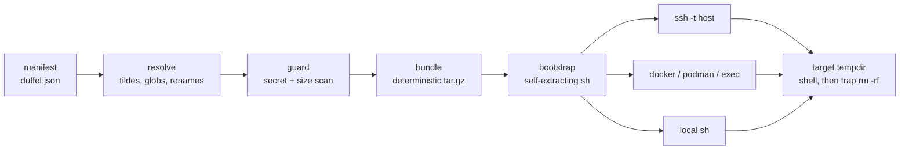

# dotduffel

[English](README.md) | [中文](README.zh.md) | [日本語](README.ja.md)

[](LICENSE) [](go.mod) [](CHANGELOG.md)  [](CONTRIBUTING.md)

**dotduffel：ssh セッションとコンテナに持ち込むオープンソースの dotfiles ダッフルバッグ——最小限のバンドルを詰め、リモートの一時ディレクトリに展開し、退出時にはホストを来たときのままに戻す。**


```bash
git clone https://github.com/JaydenCJ/dotduffel.git && cd dotduffel && go install ./cmd/dotduffel
```

> プレリリース：v0.1.0 はまだモジュールプロキシにタグ付けされていないため、上記の手順でソースからインストールしてください。単一の静的バイナリで実行時依存はゼロ。ターゲット側に必要なのは POSIX `sh`・`tar`・いずれかの base64 デコーダだけです。

## なぜ dotduffel？

リモートのマシンはいつも素の状態から始まる：作りたての devcontainer、デバッグ中の CI ランナー、同僚の staging VM——エイリアスはなく、エディタは違い、プロンプトは見知らぬもので、`set -o vi` は必要なときに限って存在しない。古典的な答えだった sshrc はとうに死んでいる——2010 年代半ばからメンテされず、bash 専用・ssh 専用で、devcontainer 以前の世界の産物だ。現代のツールは別の問題を解く：chezmoi の類いは dotfiles「マネージャ」であり、自分自身をインストールしてホストの `$HOME` に書き込む——他人のマシンで絶対にやってはいけないことそのものだ。xxh はターゲットに残り続けるポータブルシェルのツリーをアップロードする。dotduffel はエフェメラル路線を取る：小さな manifest を解決し、秘密鍵らしきものの同梱を拒否し、バイト単位で再現可能な tar.gz を組み立て、それを*コマンドそのもの*に載せて運ぶ——bootstrap は `mktemp -d` に展開し、ホスト自身の rc ファイルの上にあなたのエントリを重ね、ログアウトの瞬間に trap がすべての痕跡を消す。同じバンドルが `ssh`・`docker exec`・`podman`・`kubectl exec`・ローカル試走シェルのどれにでも乗る。トランスポートとは「`sh -c` を実行できる何か」でしかないからだ。

| | dotduffel | sshrc | xxh | chezmoi |
| --- | --- | --- | --- | --- |
| ターゲットに残る痕跡 | 0700 の一時ディレクトリ 1 つ、退出時に削除 | セッション毎の一時ディレクトリ | `~/.xxh` ツリーが常駐 | dotfiles が `$HOME` に書き込まれる |
| コンテナ（`docker`/`podman`/`kubectl`） | 第一級のトランスポート | 非対応——ssh のみ | 非対応——ssh のみ | イメージ内にバイナリが必要 |
| 送出前のシークレットガード | 7 ルール、デフォルト拒否、ファイル単位で上書き | なし | なし | 秘密を管理する——インストールという形で |
| ターゲット側の前提 | POSIX `sh` + `tar` + 任意の base64 | bash + openssl | Python かポータブルシェルの転送 | chezmoi バイナリ + bootstrap スクリプト |
| ペイロードサイズの規律 | 64 KiB 予算、超過時はファイル別内訳 | ARG_MAX で無言の失敗 | なし（ツリーごと転送） | なし（リポジトリごと clone） |
| 再現可能なバンドル | バイト単位で一致 | いいえ | いいえ | 対象外 |
| メンテナンス | v0.1.0、活発 | 最終リリース 2016 | はい | はい |

<sub>比較は 2026-07 時点の各上流リポジトリに基づく。sshrc の最終リリースは devcontainer の登場より完全に前であり、xxh の `~/.xxh` は手で消さない限りターゲットに残り続ける。</sub>

## 特徴

- **設計からしてエフェメラル** —— すべては専用の `mktemp -d` に着地し、シェルの終了と同時に trap が削除する。接続断もシグナルも例外なし。何もインストールせず、`$HOME` に書かず、ホストは来たときのまま。
- **1 つのバンドル、任意のトランスポート** —— `ssh`、`docker`/`podman exec`、kubectl/lxc/何でも繋げる汎用 `exec` プレフィックス、そしてローカル `sh` 試走。同じ自己展開スクリプトがすべてに乗り、`--print` で信用する前に正確な argv を確認できる。
- **デフォルト拒否のシークレットガード** —— PEM 秘密鍵、AWS/GitHub/Slack/npm トークン、資格情報系ファイル名、バイナリは*マシンを出る前に*拒否される。上書きは manifest のファイル単位指定のみで、コードレビューに映り、グローバルフラグは存在しない。
- **再現可能なパック** —— エポック時刻、ゼロ化された所有者、正規化されたモード、ソート済みメンバー、タイムスタンプなしの gzip：同じ manifest は永遠にバイト単位で同じ出力になる。
- **argv 予算制、超過は大声で** —— ペイロードは単一のコマンド引数に載って旅をする。64 KiB 予算と最大ファイルの内訳により、ログイン途中の `E2BIG` ではなく接続前に失敗する。
- **相手の箱に、あなたの手袋を重ねる** —— ホスト自身の `/etc/bash.bashrc` と `~/.bashrc` が先に読まれ、あなたのエントリ、env の固定値、PATH に入る同梱 `bin/` がその上に重なる。単発の `--command` 実行でもエイリアスは効く。
- **依存ゼロ** —— 純粋な Go 標準ライブラリの静的バイナリ 1 つ。自身のテストは 90 件のオフラインテストとエンドツーエンドのスモークスクリプト。

## クイックスタート

スターターのダッフルを作り、何が運ばれるかを見る：

```bash
dotduffel init
dotduffel ls
```

実際にキャプチャした出力：

```text
created ~/.config/dotduffel/duffel.json
created ~/.config/dotduffel/duffelrc
created ~/.config/dotduffel/aliases.sh
next: edit ~/.config/dotduffel/duffel.json, then test-drive with "dotduffel sh"

MODE  SIZE   DEST
644   325 B  .duffelrc
644   150 B  aliases.sh
644   283 B  duffelrc
3 files, 758 B raw -> 541 B packed -> 1.7 KiB bootstrap (2% of 64.0 KiB budget)
```

ローカルで試走——本番セッションと同一の一時ディレクトリライフサイクル、ネットワーク不要（実出力）：

```text
$ dotduffel sh --command 'echo "hello from $DUFFEL_DIR"; alias gs'
hello from /tmp/duffel.FpG5Cnyt
alias gs='git status'
```

そして実ターゲットへ——対話シェル、エイリアス装備、退出時に一時ディレクトリを抹消：

```bash
dotduffel ssh devbox                          # 追加の ssh 引数はそのまま透過: ssh devbox -p 2222
dotduffel docker mybox                        # 同じダッフルをコンテナの中へ
dotduffel exec kubectl exec -it mypod --      # `sh -c` を実行できるあらゆるトランスポート
dotduffel ssh --command 'df -h /data' devbox  # あなたの env とエイリアス込みの単発コマンド
```

そして鍵がうっかり manifest に紛れ込んだら（実出力、終了コード 1）：

```text
dotduffel: refusing to pack — 1 secret-guard finding:
  key.txt: contains a PEM private-key block at line 1 (private-key)
override per file with "allow_secrets": true in the manifest if this is intentional
```

## Manifest について

`duffel.json` の探索順：`--manifest`、`$DOTDUFFEL_MANIFEST`、`./duffel.json`、最後に `~/.config/dotduffel/duffel.json`。パースは厳格——未知のキーはエラーになり、タイポは大声で失敗する：

| キー | デフォルト | 効果 |
| --- | --- | --- |
| `entry` | `duffelrc` | ターゲットで最後に source されるファイル。ホスト自身の rc より後 |
| `shell` | `bash` | `bash` か `sh`。対話フック（`--rcfile` か `ENV`）を決める |
| `budget_kb` | `64` | bootstrap の最大サイズ（KiB、上限 100——argv の可搬性のため） |
| `files[].from` | — | ソース：`~/` パス、glob、manifest からの相対パス |
| `files[].to` | ファイル名 | バンドル内の宛先。末尾 `/` でディレクトリへのマッピング |
| `files[].allow_secrets` | `false` | ファイル単位のガード上書き。レビューで可視 |
| `exclude` | `[]` | 宛先とファイル名の両方に照合される glob パターン |
| `env` | `{}` | セッション開始時に export。ソートしシェル引用済み |

終了コード：`0` 成功、`1` パック拒否（ガードか予算）、`2` 使い方/設定/IO エラー。トランスポートは子プロセスの終了コードを透過し、bootstrap は `95`–`97` を予約する（[docs/bootstrap-protocol.md](docs/bootstrap-protocol.md)）。

## シークレットガード

バンドルは自分の管理下にないマシンの一時ディレクトリに着地するため、パックのたびにスキャナが走り、デフォルトで拒否する：

| ルール | 発火条件 |
| --- | --- |
| `private-key` | あらゆる PEM `PRIVATE KEY` ブロック：RSA、EC、DSA、OPENSSH、PGP、PKCS#8 |
| `aws-access-key` | `AKIA`/`ASIA` アクセスキー ID |
| `github-token` | `ghp_`/`gho_`/`ghu_`/`ghs_`/`ghr_` および `github_pat_` トークン |
| `slack-token` | `xox[abprs]-` トークン |
| `npm-token` | npmrc 形式ファイルの `_authToken` 行 |
| `sensitive-name` | `id_rsa` の一族、`.netrc`、`.pgpass`、`credentials`、`*.pem`/`*.p12`/`*.pfx`/`*.keystore` |
| `binary` | 先頭 8 KiB 内の NUL バイト——dotfiles はテキストであるべき |

公開側（`id_rsa.pub`、`PUBLIC KEY` ブロック、証明書）は通過する。検出はファイル・ルール・行番号を名指しし、唯一の上書き手段は当該ファイルへの `"allow_secrets": true` だけ。

## アーキテクチャ



トランスポートより左はすべて純関数——同じ manifest からは同じバイト列が出る——だからこそ 90 件のテストは完全オフラインかつ決定的に走る。

## ロードマップ

- [x] v0.1.0 —— manifest→解決→ガード→パックのパイプライン、再現可能なバンドル、自己清掃 bootstrap、ssh/docker/podman/exec/ローカルのトランスポート、シークレットガード、argv 予算、90 テスト + スモークスクリプト
- [ ] zsh と fish のエントリ（`ZDOTDIR` / XDG の技法）
- [ ] argv 予算を超えるペイロード向けの stdin トランスポート
- [ ] 再帰的なディレクトリソース（`"from": "~/.config/nvim/**"`）
- [ ] ホスト別の manifest オーバーレイ（`duffel.d/devbox.json`）
- [ ] 共有踏み台ホスト向けの age 暗号化バンドル（任意）

全リストは [open issues](https://github.com/JaydenCJ/dotduffel/issues) を参照。

## コントリビュート

バグ報告・トランスポートのアイデア・pull request を歓迎します——ローカルの作業フローは [CONTRIBUTING.md](CONTRIBUTING.md)（`go test ./...` と `SMOKE OK` を出力する `scripts/smoke.sh`）へ。入門向けタスクには [good first issue](https://github.com/JaydenCJ/dotduffel/issues?q=is%3Aissue+is%3Aopen+label%3A%22good+first+issue%22) ラベルが付き、設計の議論は [Discussions](https://github.com/JaydenCJ/dotduffel/discussions) で。

## ライセンス

[MIT](LICENSE)
