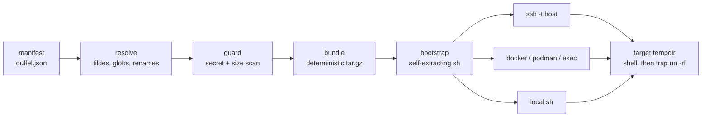

# dotduffel

[English](README.md) | [中文](README.zh.md) | [日本語](README.ja.md)

[](LICENSE) [](go.mod) [](CHANGELOG.md)  [](CONTRIBUTING.md)

**dotduffel：an open-source dotfiles duffel for ssh sessions and containers — pack a minimal bundle, unpack it into a remote tempdir, and leave the host exactly as you found it.**


```bash
git clone https://github.com/JaydenCJ/dotduffel.git && cd dotduffel && go install ./cmd/dotduffel
```

> Pre-release: v0.1.0 is not yet tagged on a module proxy; install from source as above. A single static binary, no runtime dependencies; targets need only POSIX `sh`, `tar` and a base64 decoder.

## Why dotduffel?

Every remote box starts bare: the fresh devcontainer, the CI runner you are debugging, the teammate's staging VM — no aliases, wrong editor, a prompt you do not recognize, and `set -o vi` missing exactly when you need it. The classic answer, sshrc, is long dead — unmaintained since the mid-2010s, bash-only, ssh-only, from a world without devcontainers. The modern answers solve a different problem: chezmoi and friends are dotfiles *managers* that install themselves and write into the host's `$HOME` — precisely what you must not do on a machine you do not own — and xxh uploads a portable shell tree that persists on the target. dotduffel takes the ephemeral route: resolve a small manifest, refuse to pack anything that looks like a secret, build a byte-reproducible tar.gz, and ship it *inside the command itself* — the bootstrap extracts into `mktemp -d`, layers your entry file on top of the host's own rc files, and a trap deletes every trace the moment you log out. The same bundle rides `ssh`, `docker exec`, `podman`, `kubectl exec` or a local test-drive shell, because the transport is just "anything that can run `sh -c`".

| | dotduffel | sshrc | xxh | chezmoi |
| --- | --- | --- | --- | --- |
| Footprint on the target | one 0700 tempdir, deleted on exit | tempdir per session | `~/.xxh` tree persists | your dotfiles written into `$HOME` |
| Containers (`docker`/`podman`/`kubectl`) | first-class transports | no — ssh only | no — ssh only | needs its binary inside the image |
| Secret guard before upload | 7 rules, fails closed, per-file override | none | none | manages secrets — by installing them |
| Target prerequisites | POSIX `sh` + `tar` + any base64 | bash + openssl | Python or uploaded portable shell | chezmoi binary + bootstrap script |
| Payload size discipline | 64 KiB budget, per-file breakdown on overflow | silent ARG_MAX failure | none (uploads a tree) | none (clones a repo) |
| Reproducible bundle | byte-identical packs | no | no | n/a |
| Maintained | v0.1.0, active | last release 2016 | yes | yes |

<sub>Comparison reflects upstream repositories as of 2026-07. sshrc's final release predates devcontainers entirely; xxh keeps `~/.xxh` on the target unless removed by hand.</sub>

## Features

- **Ephemeral by design** — everything lands in a private `mktemp -d`; a trap removes it when your shell exits, even on dropped connections or signals. Nothing installed, no `$HOME` writes, host left exactly as found.
- **One bundle, any transport** — `ssh`, `docker`/`podman exec`, a generic `exec` prefix for kubectl/lxc/anything, and a local `sh` test drive; the same self-extracting script rides them all, and `--print` shows the exact argv before you trust it.
- **Secret guard that fails closed** — PEM private keys, AWS/GitHub/Slack/npm tokens, credential filenames and binaries are refused *before* they leave your machine; the override is per-file in the manifest, visible in code review, never a global flag.
- **Reproducible packs** — epoch mtimes, zeroed ownership, normalized modes, sorted members, timestamp-free gzip: the same manifest packs to byte-identical output, forever.
- **Argv-budgeted, loud on overflow** — the payload travels inside a single command argument; a 64 KiB budget with a largest-files breakdown fails before connecting instead of hitting `E2BIG` mid-login.
- **Their box, your gloves on top** — the host's own `/etc/bash.bashrc` and `~/.bashrc` still load first; your entry file, env pins and a bundled `bin/` on PATH layer over them, aliases working even in one-off `--command` runs.
- **Zero dependencies** — pure Go stdlib, one static binary; its own suite is 90 offline tests plus an end-to-end smoke script.

## Quickstart

Create a starter duffel and see what would travel:

```bash
dotduffel init
dotduffel ls
```

Real captured output:

```text
created ~/.config/dotduffel/duffel.json
created ~/.config/dotduffel/duffelrc
created ~/.config/dotduffel/aliases.sh
next: edit ~/.config/dotduffel/duffel.json, then test-drive with "dotduffel sh"

MODE  SIZE   DEST
644   325 B  .duffelrc
644   150 B  aliases.sh
644   283 B  duffelrc
3 files, 758 B raw -> 541 B packed -> 1.7 KiB bootstrap (2% of 64.0 KiB budget)
```

Test-drive locally — same tempdir lifecycle as a real session, no network (real output):

```text
$ dotduffel sh --command 'echo "hello from $DUFFEL_DIR"; alias gs'
hello from /tmp/duffel.FpG5Cnyt
alias gs='git status'
```

Then point it at real targets — interactive shell, aliases loaded, tempdir wiped on exit:

```bash
dotduffel ssh devbox                          # extra ssh args pass through: ssh devbox -p 2222
dotduffel docker mybox                        # same duffel inside a container
dotduffel exec kubectl exec -it mypod --      # any transport that can run `sh -c`
dotduffel ssh --command 'df -h /data' devbox  # one-off command with your env and aliases
```

And if a key ever slips into the manifest (real output, exit code 1):

```text
dotduffel: refusing to pack — 1 secret-guard finding:
  key.txt: contains a PEM private-key block at line 1 (private-key)
override per file with "allow_secrets": true in the manifest if this is intentional
```

## The manifest

`duffel.json` is found via `--manifest`, `$DOTDUFFEL_MANIFEST`, `./duffel.json`, then `~/.config/dotduffel/duffel.json`. Parsing is strict — unknown keys are errors, so typos fail loudly:

| Key | Default | Effect |
| --- | --- | --- |
| `entry` | `duffelrc` | file sourced last on the target, after the host's own rc files |
| `shell` | `bash` | `bash` or `sh`; picks the interactive hook (`--rcfile` vs `ENV`) |
| `budget_kb` | `64` | max bootstrap size in KiB (hard ceiling 100 — argv portability) |
| `files[].from` | — | source: `~/` paths, globs, or paths relative to the manifest |
| `files[].to` | basename | destination in the bundle; a trailing `/` maps into a directory |
| `files[].allow_secrets` | `false` | per-file secret-guard override, visible in review |
| `exclude` | `[]` | glob patterns matched against destinations and basenames |
| `env` | `{}` | exported at session start, sorted and shell-quoted |

Exit codes: `0` ok, `1` refused to pack (guard or budget), `2` usage/config/IO; transports pass the child's exit code through, and the bootstrap reserves `95`–`97` for its own failures ([docs/bootstrap-protocol.md](docs/bootstrap-protocol.md)).

## Secret guard

Bundles land in tempdirs on machines you do not control, so the scanner runs on every pack and fails closed:

| Rule | Trips on |
| --- | --- |
| `private-key` | any PEM `PRIVATE KEY` block: RSA, EC, DSA, OPENSSH, PGP, PKCS#8 |
| `aws-access-key` | `AKIA`/`ASIA` access key IDs |
| `github-token` | `ghp_`/`gho_`/`ghu_`/`ghs_`/`ghr_` and `github_pat_` tokens |
| `slack-token` | `xox[abprs]-` tokens |
| `npm-token` | `_authToken` lines in npmrc-style files |
| `sensitive-name` | `id_rsa` & co., `.netrc`, `.pgpass`, `credentials`, `*.pem`/`*.p12`/`*.pfx`/`*.keystore` |
| `binary` | NUL byte in the first 8 KiB — dotfiles are text |

Public halves (`id_rsa.pub`, `PUBLIC KEY` blocks, certificates) pass. Findings name the file, rule and line; the only override is `"allow_secrets": true` on the specific file.

## Architecture



Everything left of the transports is a pure function — same manifest in, same bytes out — which is what makes the 90-test suite fully offline and deterministic.

## Roadmap

- [x] v0.1.0 — manifest→resolve→guard→pack pipeline, reproducible bundles, self-cleaning bootstrap, ssh/docker/podman/exec/local transports, secret guard, argv budget, 90 tests + smoke script
- [ ] zsh and fish entries (`ZDOTDIR` / XDG tricks)
- [ ] stdin transport for payloads beyond the argv budget
- [ ] recursive directory sources (`"from": "~/.config/nvim/**"`)
- [ ] per-host manifest overlays (`duffel.d/devbox.json`)
- [ ] optional age-encrypted bundles for shared jump hosts

See the [open issues](https://github.com/JaydenCJ/dotduffel/issues) for the full list.

## Contributing

Bug reports, transport ideas and pull requests are welcome — see [CONTRIBUTING.md](CONTRIBUTING.md) for the local workflow (`go test ./...` plus `scripts/smoke.sh` printing `SMOKE OK`). Good entry points are labelled [good first issue](https://github.com/JaydenCJ/dotduffel/issues?q=is%3Aissue+is%3Aopen+label%3A%22good+first+issue%22), and design questions live in [Discussions](https://github.com/JaydenCJ/dotduffel/discussions).

## License

[MIT](LICENSE)
