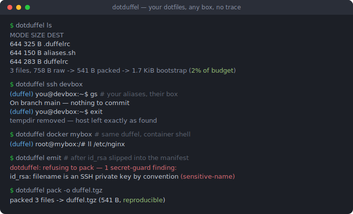
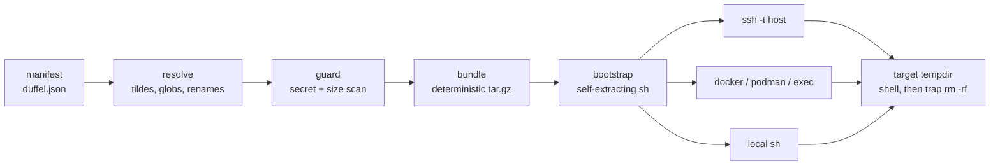

# dotduffel

[English](README.md) | [中文](README.zh.md) | [日本語](README.ja.md)

[](LICENSE) [](go.mod) [](CHANGELOG.md)  [](CONTRIBUTING.md)

**dotduffel：开源的 dotfiles 行囊，随身带进 ssh 会话和容器——打一个最小化的包，解到远端临时目录里，退出时把主机还原成你来之前的样子。**



```bash
git clone https://github.com/JaydenCJ/dotduffel.git && cd dotduffel && go install ./cmd/dotduffel
```

> 预发布：v0.1.0 尚未在模块代理上打 tag，请按上述方式从源码安装。单个静态二进制，零运行时依赖；目标机只需要 POSIX `sh`、`tar` 和任意一种 base64 解码器。

## 为什么选 dotduffel？

每台远程机器都是光板起步：新开的 devcontainer、正在排障的 CI runner、同事的 staging 虚拟机——没有别名、编辑器不对、提示符陌生，`set -o vi` 偏偏在最需要时缺席。经典答案 sshrc 早已死透——2010 年代中期起就无人维护，只支持 bash、只走 ssh，来自一个还没有 devcontainer 的世界。现代方案解决的是另一个问题：chezmoi 一类是 dotfiles「管理器」，会把自己装上去并写进主机的 `$HOME`——这恰恰是在别人机器上绝不能做的事；xxh 则上传一棵会留在目标机上的便携 shell 目录树。dotduffel 走临时化路线：解析一份小 manifest，拒绝打包任何像密钥的东西，构建字节级可复现的 tar.gz，然后把它塞进*命令本身*——bootstrap 解压到 `mktemp -d`，把你的入口文件叠在主机自己的 rc 文件之上，trap 在你退出登录的那一刻删掉所有痕迹。同一个包可以搭 `ssh`、`docker exec`、`podman`、`kubectl exec` 或本地试驾 shell，因为传输层不过是「任何能跑 `sh -c` 的东西」。

| | dotduffel | sshrc | xxh | chezmoi |
| --- | --- | --- | --- | --- |
| 在目标机上的痕迹 | 一个 0700 临时目录，退出即删 | 每会话一个临时目录 | `~/.xxh` 目录树常驻 | 你的 dotfiles 写进 `$HOME` |
| 容器（`docker`/`podman`/`kubectl`） | 一等公民传输层 | 不支持——仅 ssh | 不支持——仅 ssh | 需要镜像里有它的二进制 |
| 上传前的密钥防护 | 7 条规则，默认拒绝，按文件覆盖 | 无 | 无 | 管理密钥——方式是把它们装上去 |
| 目标机前置条件 | POSIX `sh` + `tar` + 任意 base64 | bash + openssl | Python 或上传便携 shell | chezmoi 二进制 + bootstrap 脚本 |
| 载荷体积纪律 | 64 KiB 预算，超限逐文件列明 | ARG_MAX 静默失败 | 无（上传整棵树） | 无（克隆整个仓库） |
| 可复现的包 | 字节级一致 | 否 | 否 | 不适用 |
| 维护状态 | v0.1.0，活跃 | 最后发布于 2016 | 是 | 是 |

<sub>对比基于 2026-07 时各上游仓库的状态。sshrc 的最后一次发布完全早于 devcontainer 的出现；xxh 的 `~/.xxh` 除非手动删除会一直留在目标机上。</sub>

## 特性

- **生而短暂** —— 一切都落在私有的 `mktemp -d` 里；shell 一退出 trap 就删掉它，连接断掉或收到信号也一样。不安装任何东西，不写 `$HOME`，主机原样奉还。
- **一个包，任意传输层** —— `ssh`、`docker`/`podman exec`、可接 kubectl/lxc/万物的通用 `exec` 前缀，还有本地 `sh` 试驾；同一个自解压脚本通吃，`--print` 让你在信任之前看到确切的 argv。
- **默认拒绝的密钥防护** —— PEM 私钥、AWS/GitHub/Slack/npm 令牌、凭据文件名和二进制文件在*离开你的机器之前*就被拒绝；覆盖只能在 manifest 里按文件写明，代码评审看得见，绝不是全局开关。
- **可复现的打包** —— 纪元时间戳、归零属主、规范化权限位、成员排序、无时间戳的 gzip：同一份 manifest 永远打出字节级相同的包。
- **argv 预算制，超限大声报错** —— 载荷装在单个命令参数里旅行；64 KiB 预算加最大文件排行，在连接之前就失败，而不是登录一半撞上 `E2BIG`。
- **他们的机器，戴上你的手套** —— 主机自己的 `/etc/bash.bashrc` 和 `~/.bashrc` 仍然先加载；你的入口文件、env 固定值和进 PATH 的自带 `bin/` 叠在其上，连一次性 `--command` 运行里别名也照常工作。
- **零依赖** —— 纯 Go 标准库，单个静态二进制；自身测试套件是 90 个离线测试加一个端到端冒烟脚本。

## 快速上手

创建一个起步行囊，看看会带上什么：

```bash
dotduffel init
dotduffel ls
```

真实捕获的输出：

```text
created ~/.config/dotduffel/duffel.json
created ~/.config/dotduffel/duffelrc
created ~/.config/dotduffel/aliases.sh
next: edit ~/.config/dotduffel/duffel.json, then test-drive with "dotduffel sh"

MODE  SIZE   DEST
644   325 B  .duffelrc
644   150 B  aliases.sh
644   283 B  duffelrc
3 files, 758 B raw -> 541 B packed -> 1.7 KiB bootstrap (2% of 64.0 KiB budget)
```

本地试驾——与真实会话完全相同的临时目录生命周期，无需网络（真实输出）：

```text
$ dotduffel sh --command 'echo "hello from $DUFFEL_DIR"; alias gs'
hello from /tmp/duffel.FpG5Cnyt
alias gs='git status'
```

然后指向真实目标——交互式 shell、别名就位、退出即擦除临时目录：

```bash
dotduffel ssh devbox                          # 额外的 ssh 参数原样透传: ssh devbox -p 2222
dotduffel docker mybox                        # 同一个行囊进容器
dotduffel exec kubectl exec -it mypod --      # 任何能跑 `sh -c` 的传输层
dotduffel ssh --command 'df -h /data' devbox  # 带着你的 env 和别名跑一次性命令
```

而当某个密钥不小心混进 manifest 时（真实输出，退出码 1）：

```text
dotduffel: refusing to pack — 1 secret-guard finding:
  key.txt: contains a PEM private-key block at line 1 (private-key)
override per file with "allow_secrets": true in the manifest if this is intentional
```

## Manifest 说明

`duffel.json` 的查找顺序：`--manifest`、`$DOTDUFFEL_MANIFEST`、`./duffel.json`、最后 `~/.config/dotduffel/duffel.json`。解析是严格的——未知键即报错，拼写错误会大声失败：

| 键 | 默认值 | 作用 |
| --- | --- | --- |
| `entry` | `duffelrc` | 在目标机上最后 source 的文件，晚于主机自己的 rc 文件 |
| `shell` | `bash` | `bash` 或 `sh`；决定交互钩子（`--rcfile` 还是 `ENV`） |
| `budget_kb` | `64` | bootstrap 最大体积（KiB，硬上限 100——argv 可移植性） |
| `files[].from` | — | 来源：`~/` 路径、glob，或相对 manifest 的路径 |
| `files[].to` | 文件名 | 在包内的目的地；结尾带 `/` 表示映射进目录 |
| `files[].allow_secrets` | `false` | 按文件覆盖密钥防护，评审可见 |
| `exclude` | `[]` | 同时匹配目的地和文件名的 glob 模式 |
| `env` | `{}` | 会话开始时导出，排序并做 shell 引用 |

退出码：`0` 成功，`1` 拒绝打包（防护或预算），`2` 用法/配置/IO 错误；传输命令透传子进程退出码，bootstrap 自留 `95`–`97`（[docs/bootstrap-protocol.md](docs/bootstrap-protocol.md)）。

## 密钥防护

包会落在你无法控制的机器的临时目录里，所以每次打包都要过扫描器，且默认拒绝：

| 规则 | 触发条件 |
| --- | --- |
| `private-key` | 任何 PEM `PRIVATE KEY` 块：RSA、EC、DSA、OPENSSH、PGP、PKCS#8 |
| `aws-access-key` | `AKIA`/`ASIA` 访问密钥 ID |
| `github-token` | `ghp_`/`gho_`/`ghu_`/`ghs_`/`ghr_` 及 `github_pat_` 令牌 |
| `slack-token` | `xox[abprs]-` 令牌 |
| `npm-token` | npmrc 风格文件里的 `_authToken` 行 |
| `sensitive-name` | `id_rsa` 一族、`.netrc`、`.pgpass`、`credentials`、`*.pem`/`*.p12`/`*.pfx`/`*.keystore` |
| `binary` | 前 8 KiB 内出现 NUL 字节——dotfiles 应当是文本 |

公钥一侧（`id_rsa.pub`、`PUBLIC KEY` 块、证书）放行。发现项会点名文件、规则和行号；唯一的覆盖方式是在具体文件上写 `"allow_secrets": true`。

## 架构



传输层左侧的一切都是纯函数——同样的 manifest 进，同样的字节出——这正是 90 个测试能够完全离线且确定性运行的原因。

## 路线图

- [x] v0.1.0 —— manifest→解析→防护→打包流水线、可复现的包、自清理 bootstrap、ssh/docker/podman/exec/本地传输层、密钥防护、argv 预算、90 个测试 + 冒烟脚本
- [ ] zsh 与 fish 入口（`ZDOTDIR` / XDG 技巧）
- [ ] 面向超出 argv 预算载荷的 stdin 传输
- [ ] 递归目录来源（`"from": "~/.config/nvim/**"`）
- [ ] 按主机的 manifest 叠加层（`duffel.d/devbox.json`）
- [ ] 可选的 age 加密包，用于共享跳板机

完整列表见 [open issues](https://github.com/JaydenCJ/dotduffel/issues)。

## 参与贡献

欢迎 bug 报告、传输层点子和 pull request——本地工作流见 [CONTRIBUTING.md](CONTRIBUTING.md)（`go test ./...` 加上打印 `SMOKE OK` 的 `scripts/smoke.sh`）。入门友好的任务标着 [good first issue](https://github.com/JaydenCJ/dotduffel/issues?q=is%3Aissue+is%3Aopen+label%3A%22good+first+issue%22)，设计讨论在 [Discussions](https://github.com/JaydenCJ/dotduffel/discussions)。

## 许可证

[MIT](LICENSE)
